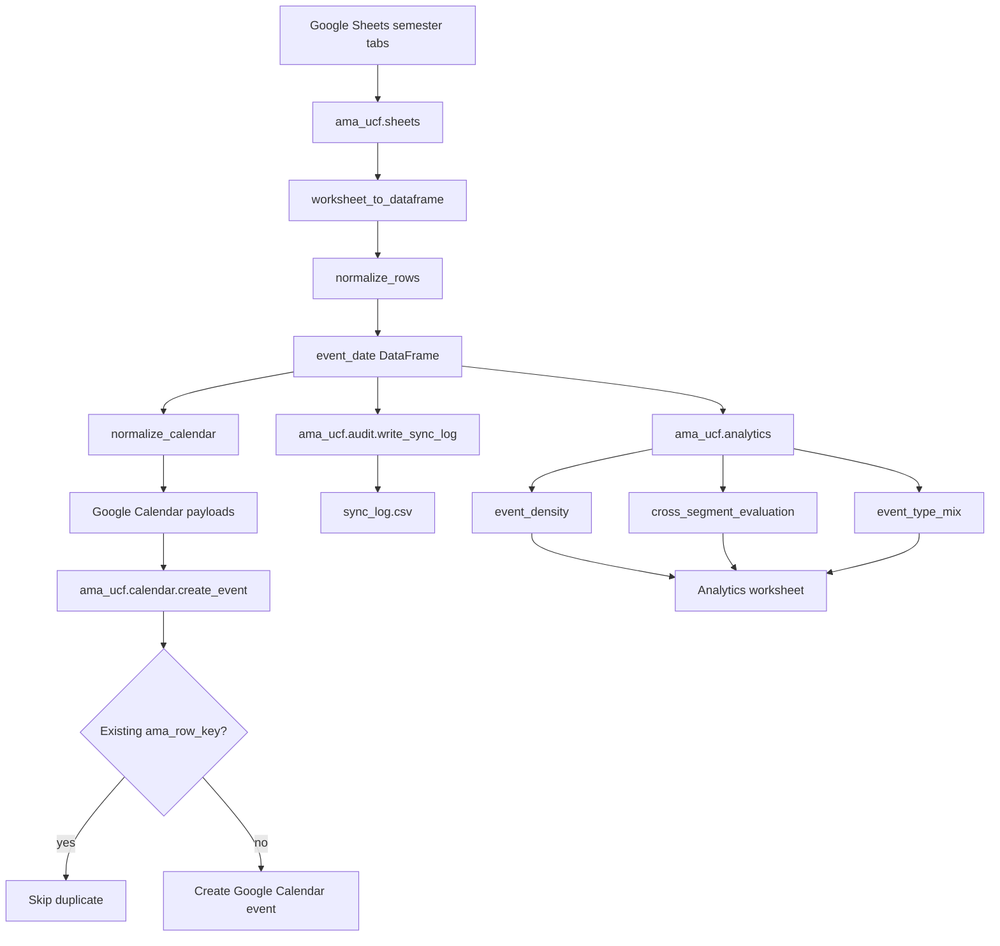
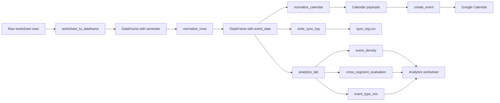

# AMA UCF Google Sheets to Google Calendar Pipeline

This project is a Python data pipeline for syncing AMA UCF event planning data from Google Sheets into Google Calendar. It reads semester-based event worksheets, normalizes the rows with Pandas, creates calendar-ready event payloads, skips duplicates, writes future events into Google Calendar, and produces lightweight audit and analytics outputs.

The intention is to turn a student organization's planning spreadsheet into a repeatable data workflow: one source of truth in Google Sheets, one public-facing operational calendar in Google Calendar, and enough logging/analytics to understand what the pipeline did.

## Project Goals

- Keep the AMA UCF calendar up to date from Google Sheets.
- Normalize spreadsheet-specific values such as Google serial dates and fractional times.
- Avoid duplicate calendar events across repeated runs.
- Support semester-specific runs with `--semester`.
- Export a CSV audit log for review and debugging.
- Generate analytics tables that can be written back to an `Analytics` worksheet.
- Keep the project small enough that another developer can clone it, configure credentials, and run it.

## Architecture



Runtime sequence:

1. `main.py` reads CLI arguments, including optional `--semester`.
2. The Sheets layer authenticates, opens the active/archive spreadsheets, selects the requested semester tab, and loads it into a DataFrame.
3. `normalize_rows()` drops unusable rows and creates the normalized `event_date` column.
4. `normalize_calendar()` filters past events and builds Google Calendar payloads.
5. The Calendar layer authenticates, resolves the destination calendar, checks each event's stable `ama_row_key`, skips duplicates, and creates missing events.
6. The audit layer writes `sync_log.csv`.
7. The analytics layer calculates summary tables and writes them to the `Analytics` worksheet.

## Data Flow



## Current Stack

- Python 3.12
- `uv` for dependency management
- Pandas for worksheet ingestion and transformations
- NumPy for analytics calculations
- `gspread` for Google Sheets access
- `gspread-dataframe` for DataFrame reads/writes
- `google-api-python-client` for Google Calendar writes
- `google-auth` and `google-auth-oauthlib` for Google authentication
- Pytest for transformation tests

## Repository Structure

```text
.
├── main.py                      # Pipeline entry point
├── pyproject.toml               # Python version and dependencies
├── ama_ucf/
│   ├── analytics.py             # Analytics tables and Analytics worksheet writer
│   ├── audit.py                 # CSV audit log writer
│   ├── calendar.py              # Google Calendar auth, duplicate checks, event creation
│   ├── config.py                # Environment-based configuration
│   ├── sheets.py                # Google Sheets access and row normalization
│   └── utils.py                 # CLI args, semester naming, time conversion
├── tests/
│   ├── test_analytics.py        # Tests for analytics calculations
│   └── test_sheets.py           # Tests for calendar normalization behavior
├── private/                     # Local credentials; ignored by Git
├── sync_log.csv                 # Generated audit export
├── .env.example                 # Required environment variable template
├── README.md
└── uv.lock
```

## Expected Google Sheet Shape

The pipeline expects each semester worksheet to contain event rows with these fields:

| Column | Purpose |
| --- | --- |
| `Date` | Google Sheets serial date value or parseable text date |
| `Time` | Google Sheets fractional time, such as `0.5` for noon |
| `Event` | Calendar event title |
| `Description` | Calendar event description |
| `Location` | Calendar location |
| `Type` | Event category, used for calendar color and analytics |

`worksheet_to_dataframe()` also adds a `semester` column using the worksheet tab title. After normalization, `normalize_rows()` adds `event_date`, which is used by the calendar and analytics layers. `normalize_calendar()` expects the column to be named `Time`; lowercase `time` is not part of the current sheet contract.

The pipeline skips any existing `Analytics` tab while reading semester data. When writing analytics, it uses the existing `Analytics` tab or creates one if it is missing.

## What Each Module Does

### `ama_ucf.sheets`

Handles Google Sheets ingestion.

- `get_credentials()` authenticates with a service account JSON file.
- `get_spreadsheets()` opens the current event spreadsheet and archive spreadsheet.
- `calendar_spreadsheet()` selects the worksheet for the requested semester.
- `worksheet_to_dataframe()` reads a worksheet into a Pandas DataFrame with `gspread-dataframe`.
- `get_all_worksheets()` combines all non-Analytics worksheets across the active and archive spreadsheets.
- `normalize_rows()` drops unusable rows and converts Google serial dates into Python dates.
- `normalize_calendar()` filters past events and turns normalized rows into Google Calendar event payloads.

### `ama_ucf.calendar`

Handles Google Calendar operations.

- Creates an OAuth-backed Calendar API service.
- Resolves the destination calendar by `CALENDAR_ID` or `CALENDAR_NAME`.
- Creates the calendar if allowed by configuration.
- Maps event types to Google Calendar color IDs.
- Builds a deterministic event key with SHA-256.
- Checks Google Calendar private extended properties to skip duplicates.
- Inserts new timed or all-day events.

### `ama_ucf.audit`

Writes a simple CSV audit artifact:

```python
write_sync_log(df, path="sync_log.csv")
```

This is intentionally lightweight. The CSV is useful for local debugging, CI artifacts, and quick inspection without adding database infrastructure.

### `ama_ucf.analytics`

Builds analytics tables from normalized all-semester data and writes them to the `Analytics` tab.

Implemented analytics:

- `event_density()` counts events by week.
- `cross_segment_evaluation()` groups by `semester` and `Type`, then calculates event count, first event date, last event date, and largest gap between events.
- `event_type_mix()` uses NumPy to calculate event type counts, event share, and cumulative share.
- `write_to_sheet()` writes the generated tables into Google Sheets with `set_with_dataframe()`.

### `main.py`

Coordinates the runtime workflow.

- Parses `--semester`.
- Runs the calendar sync for the selected semester.
- Creates future calendar event payloads.
- Skips duplicate events.
- Logs created/skipped counts.
- Runs the audit snapshot workflow.
- Runs the analytics snapshot workflow and writes analytics tables to Google Sheets.

## Duplicate Prevention

Each event gets a stable key built from:

- semester
- event summary
- event type
- start value
- location
- destination calendar id

That key is hashed and stored in Google Calendar as a private extended property:

```text
ama_row_key=<sha256 hash>
```

On future runs, the pipeline searches for that private property before creating an event. If the key already exists, the event is marked as `skipped_duplicate`.

## Analytics Outputs

### Event Density

Weekly count of events based on `event_date`.

Useful for answering:

- Which weeks are overloaded?
- Are there long quiet periods?
- Does the semester cadence look balanced?

### Cross-Segment Evaluation

Groups events by semester and event type.

Example output:

| semester | Type | event_count | first_event_date | last_event_date | largest_gap_days |
| --- | --- | ---: | --- | --- | ---: |
| Fall '26 | Workshop | 5 | 2026-09-03 | 2026-11-12 | 21 |
| Fall '26 | Social | 3 | 2026-08-28 | 2026-10-30 | 35 |

Useful for comparing programming strategy across semesters and event categories.

### Event Type Mix

Uses NumPy to calculate how much each event type contributes to the overall event calendar.

Example output:

| Type | event_count | share_of_events | cumulative_share |
| --- | ---: | ---: | ---: |
| Workshop | 12 | 0.40 | 0.40 |
| Social | 8 | 0.27 | 0.67 |
| Speaker | 6 | 0.20 | 0.87 |

Useful for seeing whether the calendar is balanced or over-concentrated in one category.

## Configuration

Copy `.env.example` to `.env` and fill in the values for your Google project.

```bash
cp .env.example .env
```

Important variables:

| Variable | Purpose |
| --- | --- |
| `SPREADSHEET_ID` | Active Google Sheet containing current event tabs |
| `ARCHIVE_SPREADSHEET_ID` | Archive Google Sheet containing older semester tabs |
| `CALENDAR_ID` | Optional explicit Google Calendar ID |
| `CALENDAR_NAME` | Calendar name to find or create when `CALENDAR_ID` is not set |
| `CALENDAR_TIMEZONE` | Timezone for timed events, defaults to `America/New_York` |
| `CREDENTIALS_WORKSHEET_FILE_PATH` | Service account JSON path for Sheets access |
| `CREDENTIALS_CALENDAR_FILE_PATH` | OAuth client JSON path for Calendar access |
| `TOKEN_FILE_PATH` | Local OAuth token path generated after login |
| `SEMESTER_FORMAT` | Format used by automatic semester selection |
| `POLL_INTERVAL_SECONDS` | Reserved for polling/watch-style workflows |

Example local credential layout:

```text
private/
├── google_service_account.json
├── google_calendar_oauth_client.json
└── token.json
```

Do not commit files in `private/`.

## Google Cloud Setup

1. Create or select a Google Cloud project.
2. Enable these APIs:
   - Google Sheets API
   - Google Calendar API
   - Google Drive API
3. Create a service account for Google Sheets access.
4. Download the service account JSON file and store it under `private/`.
5. Share the source Google Sheets with the service account email.
6. Create OAuth client credentials for Google Calendar access.
7. Download the OAuth client JSON file and store it under `private/`.
8. Set the credential paths in `.env`.
9. On the first local run, complete the browser OAuth flow so `token.json` can be generated.

## Local Setup

Install dependencies:

```bash
uv sync
```

Run tests:

```bash
uv run pytest
```

Run the default sync:

```bash
uv run python main.py
```

Run a specific semester tab:

```bash
uv run python main.py --semester "Fall '26"
```

The semester string must match the worksheet tab name in Google Sheets.

## GitHub Actions Setup

The repository includes two workflows:

- `.github/workflows/ci.yml` runs import checks, tests, and package build validation on pushes, pull requests, and manual dispatch.
- `.github/workflows/sync.yml` runs the Google Sheets to Google Calendar sync on a weekly schedule and can also be started manually with an optional `semester` input.

To make the scheduled sync work, add these GitHub repository secrets:

| Secret | Purpose |
| --- | --- |
| `SPREADSHEET_ID` | Active Google Sheet ID |
| `ARCHIVE_SPREADSHEET_ID` | Archive Google Sheet ID |
| `CALENDAR_ID` | Optional destination Google Calendar ID |
| `GOOGLE_SHEETS_CREDENTIALS_JSON` | Full service account JSON for Google Sheets access |
| `GOOGLE_CALENDAR_CREDENTIALS_JSON` | Full OAuth client JSON for Google Calendar access |
| `GOOGLE_CALENDAR_TOKEN_JSON` | OAuth token JSON generated from a successful local Calendar login |

Optional repository variables:

| Variable | Default |
| --- | --- |
| `CALENDAR_NAME` | `AMA Calendar` |
| `CALENDAR_TIMEZONE` | `America/New_York` |
| `POLL_INTERVAL_SECONDS` | `300` |

The important detail is `GOOGLE_CALENDAR_TOKEN_JSON`: GitHub Actions cannot complete the local browser OAuth flow, so generate `token.json` locally first, then copy that file's JSON content into the secret.

## Replication Checklist

Use this checklist to adapt the project for another organization.

1. Create a Google Sheet with semester tabs.
2. Add the required columns: `Date`, `Time`, `Event`, `Description`, `Location`, and `Type`.
3. Optionally add an `Analytics` worksheet tab; the pipeline can create it if it is missing.
4. Create or choose a Google Calendar destination.
5. Configure Google Cloud credentials.
6. Share the Sheets file with the service account.
7. Fill in `.env`.
8. Run `uv sync`.
9. Run `uv run pytest`.
10. Run `uv run python main.py --semester "<tab name>"`.
11. Confirm new events appear in Google Calendar.
12. Confirm `sync_log.csv` is generated.
13. Confirm analytics tables appear in the `Analytics` tab.
14. Add the GitHub Actions secrets and variables if you want scheduled syncs.
15. Run the `Sync AMA UCF Google Sheets to Google Calendar` workflow manually once before relying on the weekly schedule.

## Design Intentions

This project is intentionally split into small modules:

- Sheets code only knows how to read and normalize spreadsheet data.
- Calendar code only knows how to authenticate, detect duplicates, and create events.
- Analytics code only knows how to calculate and write reporting tables.
- Audit code only knows how to persist a simple run artifact.
- `main.py` owns orchestration.

That separation makes the workflow easier to test, easier to explain, and easier to extend. For example, the CSV audit log could later become SQLite or Postgres without changing the Sheets normalization logic.

## Error Handling Lesson

Earlier versions of this project wrapped most function results in dictionaries shaped like:

```python
{"success": True, "error": None, "data": value}
```

That was meant to mimic the feel of FastAPI-style response objects: every function had a predictable response shape, and callers could check success before moving forward. The idea made sense in spirit, but it was the wrong abstraction for this project.

FastAPI route handlers sit at an HTTP boundary. Returning a dictionary there becomes JSON for an outside client. This project is not crossing that boundary between modules; it is a local Python pipeline where functions call each other in the same process. In that context, wrapping everything in response dictionaries did not create real JSON behavior. It just added another layer that every caller had to unwrap.

The bigger problem was debugging. Broad `except Exception` blocks converted useful tracebacks into strings too early. A real bug such as using `cell_title.column` instead of gspread's actual `cell_title.col` became a nested runtime message instead of pointing directly to the bad line. The wrapper made the program look controlled, but it made failures harder to trace.

The current design returns native Python objects directly:

- Data loading functions return clients, worksheets, or DataFrames.
- Normalization functions return DataFrames or event payload lists.
- Calendar functions return created/skipped event status dictionaries only where that status is real domain data.
- Expected validation problems raise `ValueError`.
- Unexpected programming or API errors raise normally with their original traceback.

Lesson learned: response wrappers are useful at actual service boundaries, but inside a local pipeline they can become noise. Native returns plus clear exceptions are simpler, easier to test, and much easier to debug.


## Roadmap Status

- Pandas DataFrame ingestion through `gspread-dataframe`: done.
- Calendar event payload normalization: done.
- Duplicate prevention with hashed event keys: done.
- CSV audit logging: done.
- NumPy-backed analytics functions: done.
- `--semester` argument for reusable semester runs: done.
- Analytics worksheet writer: done.
- Pytest coverage for normalization: done.
- GitHub Actions CI workflow: done.
- GitHub Actions scheduled sync workflow: done; requires repository secrets and a valid Calendar token.

Created by Humberto Bohorquez. Built with Python, Pandas, NumPy, and Google APIs.

Licensed under MIT. See `LICENSE` for details.
